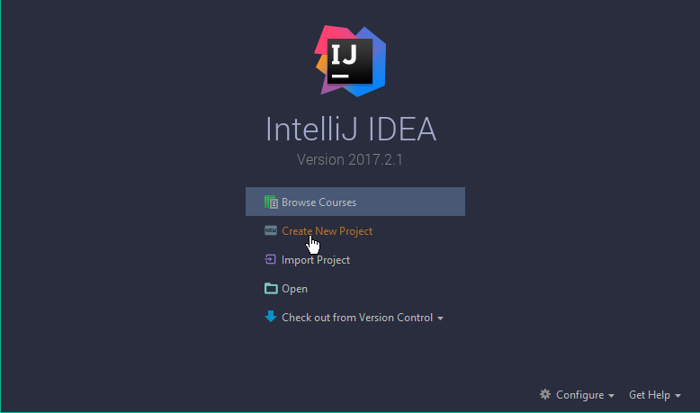
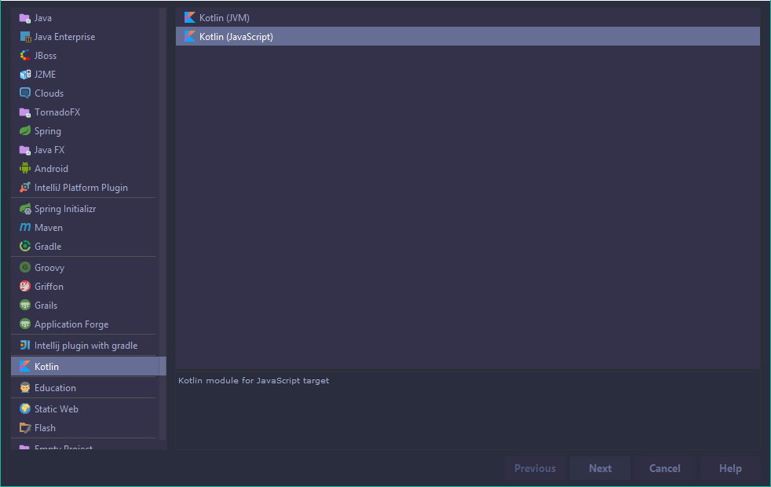
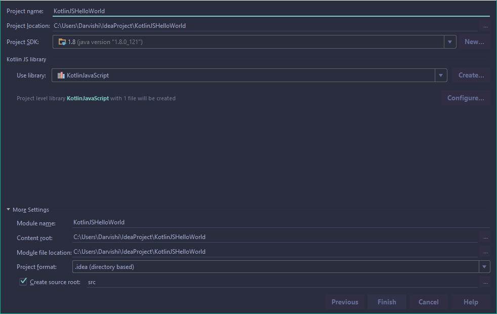
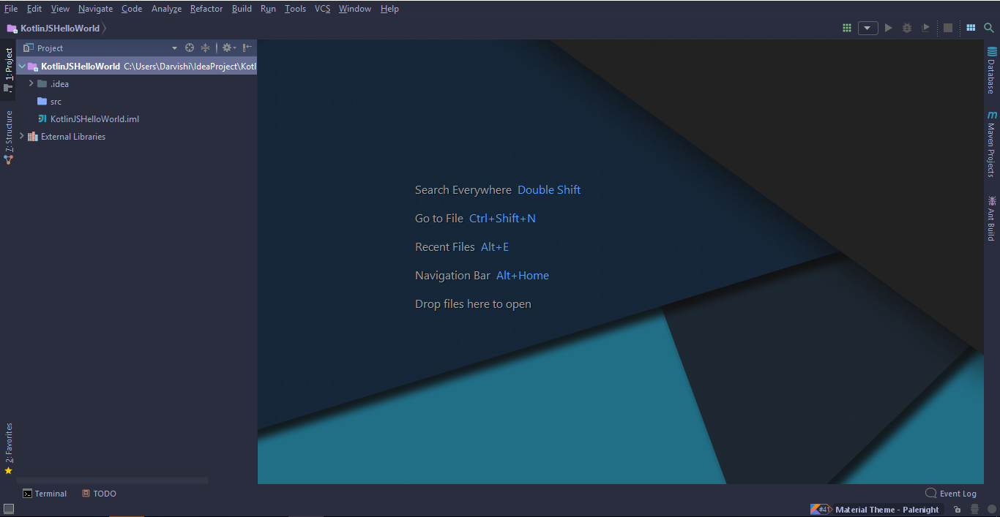
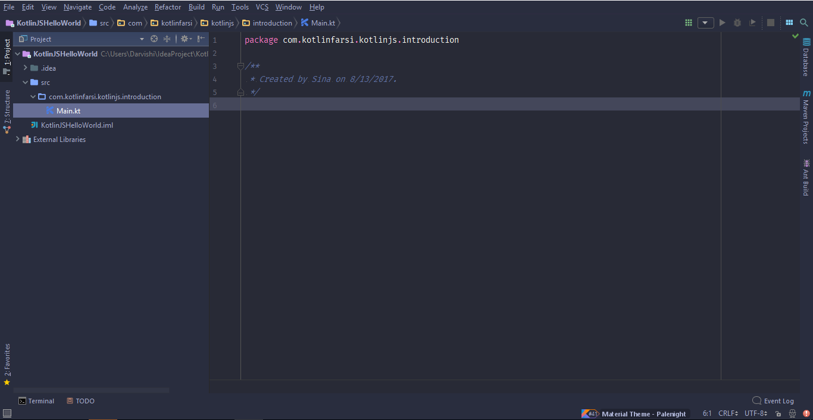
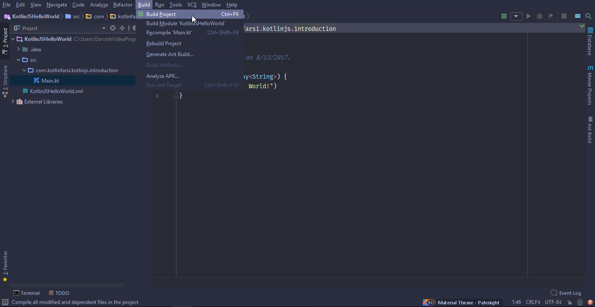
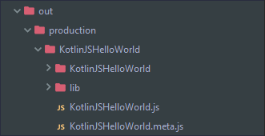
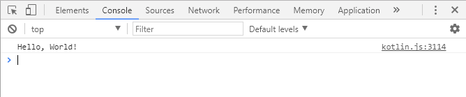

<div dir="rtl">

# یک Hello World ساده

امروز میخوام بهتون یادبدم چطور برنامه­های JavaScript ای با استفاده از زبون کاتلین بنویسین. همینطور که میدونید و شاید جاهای زیادی خونده باشین، کاتلین یکی از هدف­هاش ساختن اپ­های سمت سرور و هم سمت کلاینت با JavaScript هه. حالا بیشتر درمورد ویژگی­ها و توانایی­هاش توی این زمینه صحبت میکنیم ولی امروز میخوایم این دوره رو با ساختن یک برنامه Hello World ساده شروع کنیم.

اولین کاری که باید انجام بدین اینه که IntelliJ IDEA رو بالا بیارین و روی دکمه Create New Project کلیک کنین.





و بعدش از داخل صفحه­ای که ظاهر میشه Kotlin(JavaScript) رو به عنوان تارگت انتخاب کنین و برروی دکمه Next کلیک کنین. یادتون باشه که فعلا نمیخوایم از هیچگونه بیلدری غیر از بیلدر خود IntelliJ استفاده کنیم. بعدا توی دورمون به بیلد­هایی مثل gradle و یا maven اشاره میکنیم.





برای شروع اسم پروژه رو KotlinJSHelloWorld میذاریم و بعدش Next رو فشار میدیم.





و حالا بعد از چندتا پردازش محیط توسعه برامون ظاهر میشه و میتونیم کدهامون رو توش بزنیم.





خب حالا باید یک پکیج داخل فولدر src درست کنیم و فایل `Main.kt` رو داخلش قرار بدیم.





خب تا اینجا پروژمون آماده شد. بریم سراغ اصل قضیه یعنی کدنویسی. کد زیر رو توی فایل 

`Main.kt` میزنیم:

</div>

```kotlin
fun main() {
    println("Hello, World!")
}
```

<div dir="rtl">

یادتون باشه، توی این دوره نمیخوایم با سینتکس کاتلین آشنا بشیم و فرض میکنیم حداقل دوره Intruction to Kotlin رو گذروندین، ولی هر از چندگاهی یک اشاره هایی به سینتکس میکنیم که اگر فراموش کرده بودین یک یادآوری براتون بشه. بالا هم تنها کاری که کردیم ساختن یک main و چاپ کردن `Hello, World` بود.در حقیقت این متن توی کنسول جاوا اسکریپت ران میشه. 

خب حالا باید این فایل رو بیلد کنیم. از توی قسمت 

build توی نوار ابزار بالا، دکمه build Project رو پیدا کنین و فشارش بدین.



و حالا اگه دقت کنین متوجه میشین که توی قسمت Project، سمت راست، یه فولدر جدید ایجاد شده که اگه اونو باز کنین متوجه میشین که خروجی هامون اونجا ریخته میشه!



همینطور میتونین همونجا فایل `KotlinJSHelloWorld.js` رو هم ببینین، که خروجی جاوا اسکریپت ماهستش. بالای اون دوتا فولدر میبینین. بعدا به محتویات فولدر اول اشاره میکنیم ولی فعلا قسمت مهمی که نیاز به بررسی داره فولدر lib هستش. اگه اونو باز کنین متوجه میشین که یک فایل `kotlin.js` داخلش هست که درحقیقت کتابخونه استاندارد کاتلین مورد نیاز برای اجرای برنامه های جاوا اسکرپیتیمونه. علاوه بر اون یک سری فایل­ها میبینین که اخرش `*.meta.js` داره. درحقیقت ما فعلا نیازی به استفاده از این فایل ها نداریم، ولی در این حد بدونین که زمانی که مثلا میخواین از اون فایل .js به عنوان یک کتابخونه استفاده کنین، توسط کامپایلر مورد استفاده قرار میگیره.

 حالا بیاین برگردیم به محیط توسعه­امون و از این فایل خروجیمون استفاده کنیم. برای نشون دادن خروجی ما از یک فایل html استفاده میکنیم. برای همین ما توی مسیر root یک فایل html درست میکنیم و کدهای زیر رو داخلش میزنیم.

</div>

```html
<!DOCTYPE html>
<html lang="en">
<head>
    <meta charset="UTF-8">
    <title>Kotlin JS Hello World</title>
</head>
<body>
    <script src="out/production/KotlinJSHelloWorld/lib/kotlin.js"></script>
    <script src="out/production/KotlinJSHelloWorld/KotlinJSHelloWorld.js"></script>
</body>
</html>
```

<div dir="rtl">

دو خط script که نوشتیم یکی فایل کتابخونه استاندارد رو به عنوان منبع قرار میده و دیگری هم اون فایل `.js` که درست کردیم رو. برای دیدن این فایل کافیه یکی از مرورگرها رو بالا بیاریم و به قسمت developers Tools بریم و در قسمت console نیجه خروجی رو ببینیم.





توی قسمت بعدی میبینیم که چطور میتونیم در کاتلین با DOM کار کنیم.

</div>
